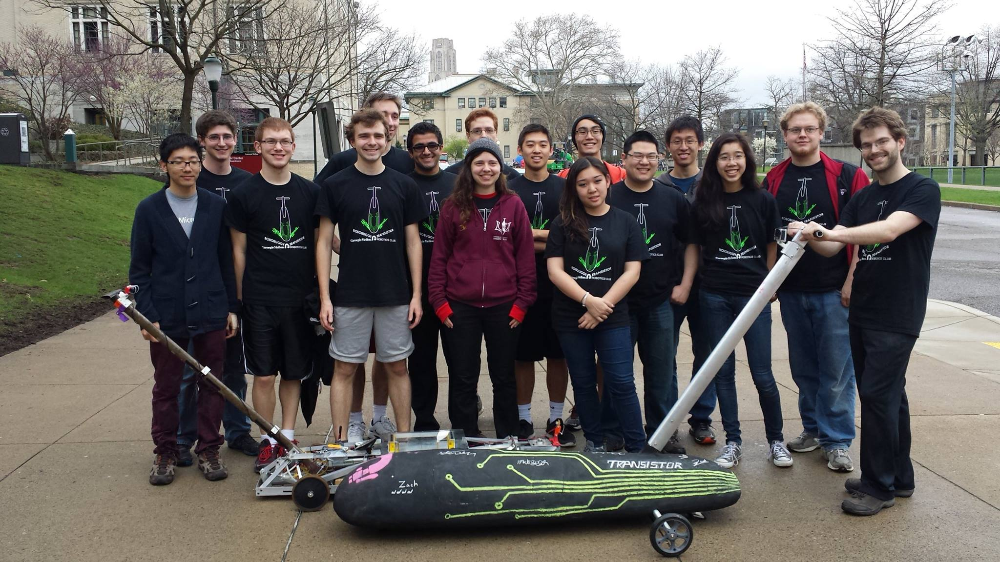
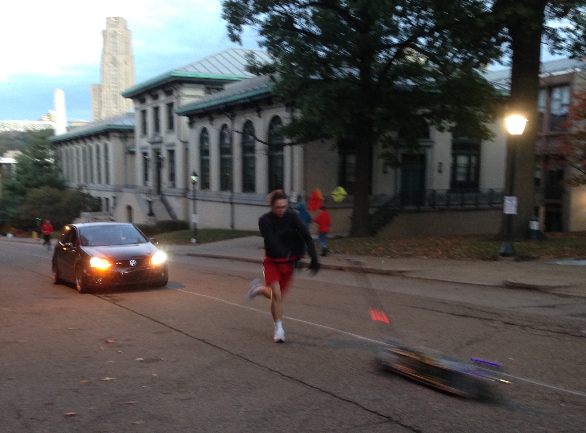
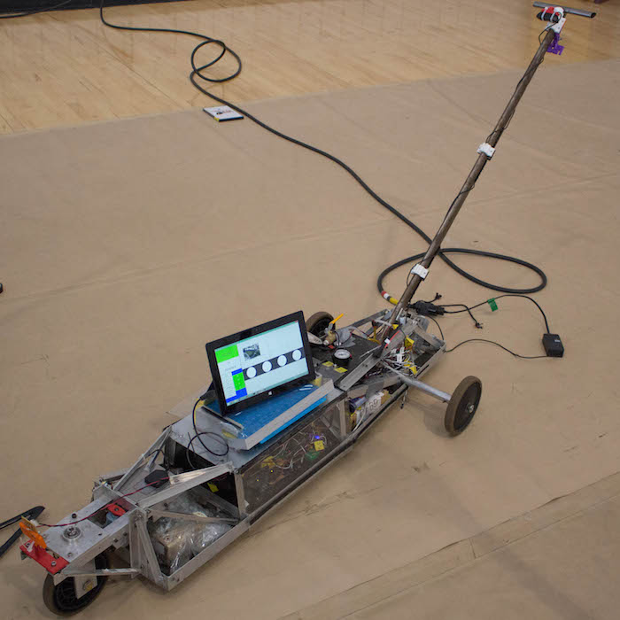
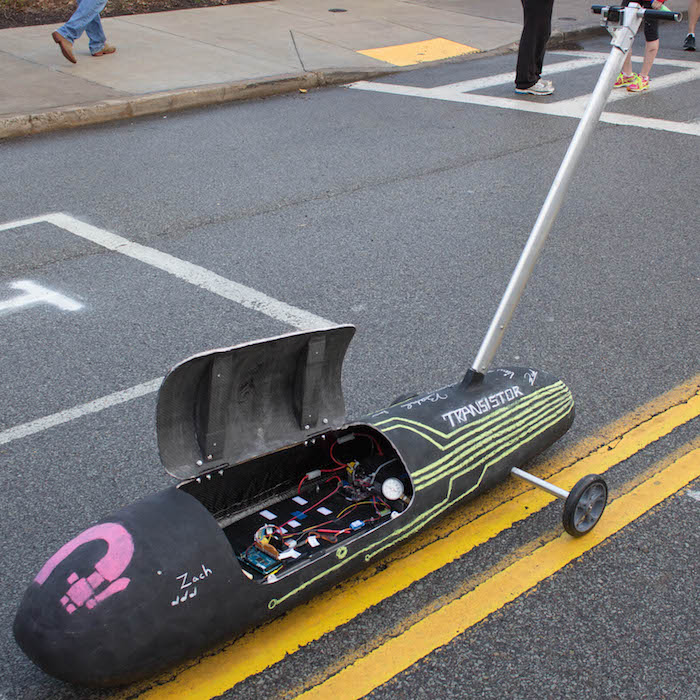

RoboBuggy
==============

A project of the [Robotics Club at Carnegie Mellon University](https://roboticsclub.org/).

[](https://travis-ci.org/CMU-Robotics-Club/RoboBuggy/builds) [](https://www.codacy.com/app/Mr-Trevor-Decker/RoboBuggy)


> Buggy (also called Sweepstakes) is a race held annually since 1920 at Carnegie Mellon. Teams of 5 athletes (the pushers) push an un-motorized vehicle (a buggy) containing a driver around a 0.84 mile course in a relay format where the vehicle serves as the baton. Roughly half of the course is uphill, during which the pushers run and shove the buggy uphill. During the other - downhill - half, drivers are on their own to navigate tight turns at speeds of up to 35mph.


Borrowed from the [CMU Buggy Alumni Association](http://cmubuggy.org/reference/What_is_buggy%3F). Visit them to find out more.

In the robotics club we seek to ~~help out robot overlords~~ automate everyone and everything, so we're trying hard to replace a traditional buggy driver with our AI. Alice (the AI) isn't quite ready to take command of Singularity or Transistor, but we still take her out for training during morning practice rolls. Keep on reading to find out more, or just enjoy these team pictures.


_Team picture from Raceday 2015._


_Trevor pushing Singularity on Hill 4 during early morning rolls._

## The Buggies 

<table>
<thead>
<tr>
<th align="center" width="50%">Singularity</th>
<th align="center" width="50%"><del>Toothless</del> Transistor</th>
</tr>
</thead>
<tbody>
<tr>
<td align="center"></td>
<td align="center"></td>
</tr>
<tr>
<td align="center">Inherited from a past incarnation of this project, Singularity has been rolling since 1999. She features a bolted aluminum frame that was originally built around a desktop computer. These days, she features a stylish mount for a Surface on top with the control electronics inside.</td>
<td align="center">Transistor was built for the 2015 season using modern carbon fiber shell technology. She was built to be accessible and maintainable as a platform for the future of Robobuggy. Debate within the team on what style she would wear was so fierce we chose to paint her chalkboard black, complete with a new chalking each race.</td>
</tr>
</tbody>
</table>

Looking for more technical docs? [Check out the wiki!](https://github.com/CMU-Robotics-Club/RoboBuggy/wiki)

## System Overview

```
+-----------------+
|   Follow Car    |
|        +        |
|  Safety Driver  |
+-----------------+
         ||
         ||
         \/
+------------------+   +-------------------------+
|  Radio Receiver  |   |  Alice (AI on Surface)  |
+------------------+   +-------------------------+
         ||                        /\
         ||                        ||
         \/                        \/
+------------------------------------------------+
|           IO and Safety Controller             |
|                  (Arduino++)                   |
+------------------------------------------------+
                        /\
                        ||
                        \/
+------------------------------------------------+
|               Electromechanical                |
|       (Servo, Solenoids, Pots, Encoders)       |
+------------------------------------------------+
                        /\
                        ||
                        ||
         ____           ||
           \            \/
            \   _____________________
            _\./    \______/      \__\
           < ___o_________________o___\ 
--------------------------------------------------

```
_System block diagram._

Our system architecture keeps a human in the loop all the time, even just to hit the emergency stop button. The human driver can either be sending drive commands (for AI training) or monitoring the AI. The command signals from the AI and human are mixed together (depending on operating mode) in the IO controller. Here we also do last level safety checks like stop on disconnection. The IO controller interfaces directly with the electromechanical systems to make braking, steering, and sensing happen. Find more information in the source directories below.


## File Structure 

The software system is separated into two main directories (sections):
* offline -> where code which is not executed in realtime on the buggy is stored
* real_time -> where code which is being run in realtime on the buggy is stored 

This folder also contains: 
* Pictures for this readme file
* configuration files

## Contributing

We have a [contributions guide](CONTRIBUTING.md) to get you started.

## Sponsors

Special thanks to Microsoft for providing Alice a host interface on a Surface Pro 3!

Think this project is cool? Please support the [Robotics Club at CMU](https://roboticsclub.org/sponsors/)!

